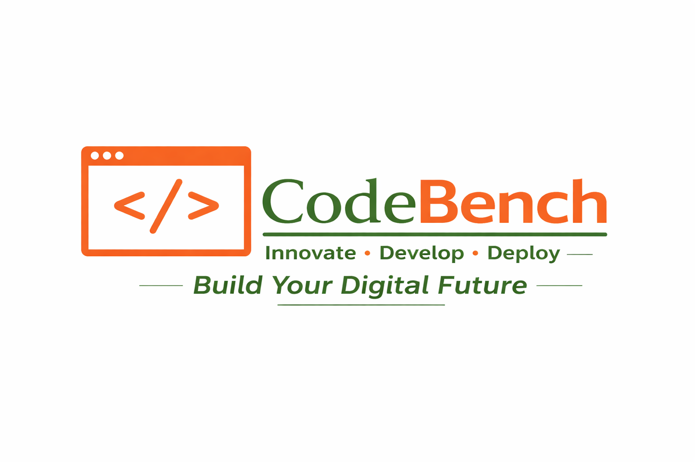

# CodeBench 🚀



## 🌐 Live Links
- **Frontend (Vercel):** [code-bench-ui.vercel.app](https://code-rover-frontend.vercel.app/)
- **Backend (Render):** [code-bench-api.onrender.com](https://coderover-frontend.onrender.com/)

> **Note:** The **Docker-based Code Execution** feature requires a local setup with Docker Desktop running, as cloud platforms (Vercel/Render) do not support spawning nested Docker containers in their free tiers.

---

## 📖 Overview

**CodeBench** is a high-performance, full-stack platform designed for **remote technical interviews** and **collaborative coding**. It features a secure, containerized execution engine and real-time synchronization, allowing users to solve complex algorithmic problems in a shared virtual room.

### Key Features
- **Isolated Code Execution:** Every submission runs in a fresh **Docker container**, ensuring the host system is protected from malicious code.
- **Real-Time Collaboration:** Powered by **Socket.io** for instant code syncing, cursor tracking, and room-based interviewing.
- **Problem Archive:** A structured database of coding challenges with descriptions, constraints, and hidden test cases.
- **Secure Authentication:** Robust user management using **JWT (JSON Web Tokens)** and HTTP-only cookies.
- **Dashboard & Analytics:** Track solved problems and user performance via a personalized profile.

---

## 🛠️ Tech Stack

| Layer | Technologies |
| :--- | :--- |
| **Frontend** | React.js, Redux Toolkit, Tailwind CSS, Vite |
| **Backend** | Node.js, Express.js |
| **Database** | MongoDB (Mongoose) |
| **Real-time** | Socket.io |
| **DevOps** | Docker (Containerization Engine) |
| **Cloud** | Cloudinary (Image Storage) |

---

## 🚀 Local Installation

### 1. Clone the Project
```bash
git clone [https://github.com/SumanMehta/CodeBench.git](https://github.com/SumanMehta/CodeBench.git)
cd CodeBench
PORT=8000
MONGO_URI=your_mongodb_connection_string
ACCESS_TOKEN_SECRET=your_secret_key
REFRESH_TOKEN_SECRET=your_refresh_key
CLOUDINARY_CLOUD_NAME=your_name
CLOUDINARY_API_KEY=your_key
CLOUDINARY_API_SECRET=your_secret
VITE_BACKEND_URL=http://localhost:8000
VITE_BACKEND_URL_FOR_SOCKET=http://localhost:8000
npm install && npm run dev

4. Docker Setup
Install Docker Desktop on Windows.

Ensure Docker is running before clicking "Run Code" in the application.

CodeBench will automatically pull the necessary execution images.
Author
   Suman Mehta 
MCA Student @ National Institute of Technology (NIT), Raipur - Email: sumanmehta8298@gmail.com
LeetCode: 650+ Problems Solved
GeeksforGeeks: 250+ Problems Solved